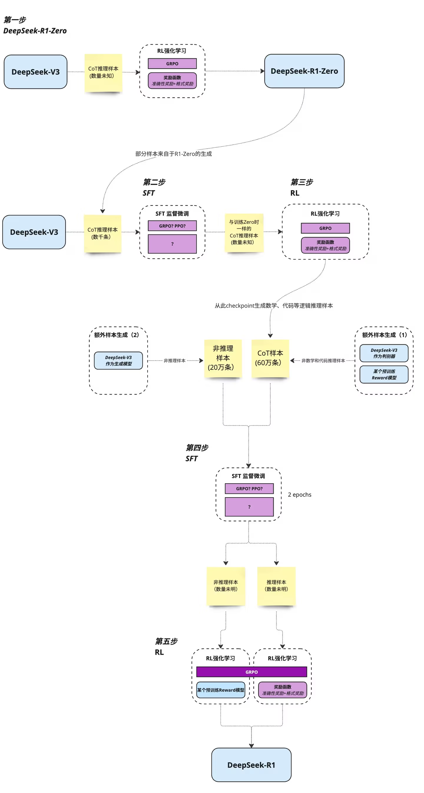

# [DeepSeek](https://www.deepseek.com/)

## DeepSeek 学习资料
Github
- [DeepSeek-V3](https://github.com/deepseek-ai/DeepSeek-V3)
- [DeepSeek-R1](https://github.com/deepseek-ai/DeepSeek-R1)

论文 
- [《DeepSeekMath》](https://arxiv.org/pdf/2402.03300)
- [《DeepSeek-R1》](https://github.com/deepseek-ai/DeepSeek-R1/blob/main/DeepSeek_R1.pdf)

B站 OR Youtube
- [DeepSeek R1 Theory Overview | GRPO + RL + SFT](https://www.youtube.com/watch?v=QdEuh2UVbu0)
- [读R1的训练过程《DeepSeek-R1》论文导读](https://www.bilibili.com/video/BV1EmF9e6EdG)
- [有难度但必读的一篇论文《DeepSeekMath》](https://www.bilibili.com/video/BV1qUFMeGE2q)
- [上手代码复现DeepSeek-R1强化学习训练演示](https://www.bilibili.com/video/BV1XDPQeeEF7)

其他博客

- [A vision researcher’s guide to some RL stuff: PPO & GRPO](https://yugeten.github.io/posts/2025/01/ppogrpo/)

总结的R1训练流程图

## DeepSeek 在 AWS 上的资料
- [Benefits of installing DeepSeek on an AWS EC2 instance
](https://community.aws/content/2sHGS4Eqeekz32OOzn7am5lnGEX/benefits-of-installing-deepseek-on-an-aws-ec2-instance)
- [DeepSeek-R1 Distill Model on CPU with AWS Graviton4
](https://community.aws/content/2rhRJI6cxBa1Ib5f3TjsfPadpXs/deploying-deepseek-r1-distill-llama-70b-for-batch-inference-on-aws-graviton4)
- [Deploy DeepSeek-R1 distilled Llama models with Amazon Bedrock Custom Model Import
](https://aws.amazon.com/cn/blogs/machine-learning/deploy-deepseek-r1-distilled-llama-models-with-amazon-bedrock-custom-model-import/)
- [Get started with DeepSeek R1 on AWS Inferentia and Trainium](https://repost.aws/articles/ARDaRTyEVQR9iWfVdek2CQwg/get-started-with-deepseek-r1-on-aws-inferentia-and-trainium)
- [Deploying DeepSeek model on AWS inferentia with vLLM
](https://community.aws/content/2sKnCT05v1WiD0Dw8QB5wfAf1Cm/deploying-deepseek-llama-model-on-amazon-ec2-inferentia-instance)
- [Deploying DeepSeek-R1 Distill Model on Amazon EC2
](https://community.aws/content/2sEuHQlpyIFSwCkzmx585JckSgN/deploying-deepseek-r1-14b-on-amazon-ec2)

