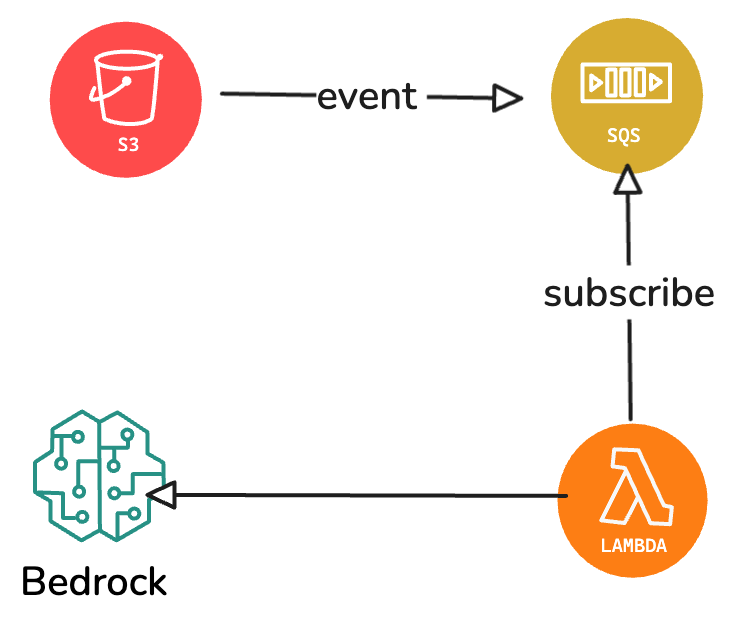

# 视频分类程序

使用 AWS Boto3 SDK 实现的视频分类工具。

## 功能概述

该视频分类工具包含3个模块：

### 公共模块

提供公共的工具类和方法：

1. LLM调用方法：调用 Bedrock 大模型，输入 S3 视频 URI、prompt、system 和模型 ID 等参数，输出模型理解的结果。
2. 视频转文本方法：输入 S3 视频 URI，如果视频超过30秒，截取前30秒，返回视频中的音频文本。
3. 分类结果校准方法：输入一、二、三级分类，根据分类级别读取三级分类对象，计算向量相似度最接近的词输出。
4. JSON结果解析方法：从文本中提取 JSON 格式数据，如果格式不正确，调用 Nova Lite 修复。

### 视频分类模块

一次性输入视频信息和 prompt 提示词信息，返回视频分类结果：

1. 读取 prompt 文件，获取提示词，设置 LLM system 人设为视频分类专家。
2. 返回视频分类结果，解析 JSON 结果。
3. 校准分类结果。
4. 统计 token 消耗量。
5. 将结果写入 CSV 文件。

### 视频评测模块

读取视频分类结果和真实分类结果，计算准确率。

### 比较测试模块

比较不同模型和方法的准确率和速度：

1. 模型 ID：Amazon Nova Pro 和 Amazon Nova Lite
2. 分类方法：一步分类和两步分类

## 安装

1. 克隆仓库：

```bash
git clone <repository-url>
cd video_classify
```

2. 安装依赖：

```bash
## ffmpeg
查看版本
ffmpeg -version
如果不存在就安装
### macOS
brew install ffmpeg
### Ubuntu
sudo apt-get install ffmpeg
### CentOS
sudo yum install ffmpeg # centOS/RHEL 7
sudo dnf install ffmpeg # centOS/RHEL 8 / amazon linux 2023

### 安装python依赖
pip install -r requirements.txt
```

## 使用方法

### 视频预处理

输入video-input.csv 需要处理的视频, 截取前30秒视频，并存储到指定的S3桶中，
输出 video-output.csv

```bash
python trim_videos.py --input data/video-input.csv --output data/video-output.csv
```

### 视频批量分类

从classification_data.csv读取视频S3地址，进行分类，并将结果写入以方法和模型命名的结果文件中：

```bash
python video_classify.py process --method one_step --model-id amazon.nova-lite-v1:0
```

或者使用两步分类方法：

```bash
python video_classify.py process --method two_step --model-id amazon.nova-lite-v1:0
```

结果文件将自动命名为 `data/classification_results_<method>_<model>.csv`，例如：
- `data/classification_results_one_step_nova-lite.csv`
- `data/classification_results_two_step_nova.csv`

### 视频分类

一步分类方法：

```bash
python video_classify.py classify s3://bucket-name/video.mp4 --method one_step --model-id amazon.nova-lite-v1:0
```

两步分类方法：

```bash
python video_classify.py classify s3://bucket-name/video.mp4 --method two_step --model-id amazon.nova-lite-v1:0
```

结果文件将自动命名为 `data/classification_results_<method>_<model>.csv`，除非使用 `--output-csv` 参数指定输出文件路径。

### 视频转文本

```bash
python video_classify.py transcribe s3://bucket-name/video.mp4 --max-duration 30
```

### 评估分类结果

```bash
python video_classify.py evaluate classification_results.csv ground_truth.csv
```

### 比较测试

```bash
python video_classify.py compare videos.csv ground_truth.csv --model-ids amazon.nova-lite-v1:0,amazon.nova-v1:0 --methods one_step,two_step
```

## 参数说明

### 分类命令参数

- `s3_uri`：视频的 S3 URI
- `--method`：分类方法，可选 `one_step` 或 `two_step`，默认为 `one_step`
- `--prompt`：提示词文件路径（一步分类方法），默认为 `prompt/one_step_prompt.md`
- `--first-prompt`：第一步提示词文件路径（两步分类方法），默认为 `prompt/two_step1_prompt.md`
- `--second-prompt`：第二步提示词文件路径（两步分类方法），默认为 `prompt/two_stop2_prompt.md`
- `--model-id`：模型 ID，默认为 `amazon.nova-lite-v1:0`
- `--region`：AWS 区域，默认为 `us-east-1`
- `--output-csv`：输出 CSV 文件路径（如果不提供，将根据方法和模型ID自动生成）
- `--categories-path`：分类类别JSON文件路径，默认为 `category.json`

### 评估命令参数

- `classification_csv`：分类结果 CSV 文件路径
- `ground_truth_csv`：真实分类结果 CSV 文件路径
- `--model-id`：用于评估的模型 ID，默认为 `amazon.nova-lite-v1:0`
- `--region`：AWS 区域，默认为 `us-east-1`
- `--output-csv`：输出 CSV 文件路径，默认为 `data/evaluation_results.csv`

### 比较命令参数

- `videos_csv`：包含视频 S3 URI 的 CSV 文件路径
- `ground_truth_csv`：真实分类结果 CSV 文件路径
- `--model-ids`：要测试的模型 ID 列表，以逗号分隔，默认为 `amazon.nova-lite-v1:0,amazon.nova-v1:0`
- `--methods`：要测试的方法列表，以逗号分隔，默认为 `one_step,two_step`
- `--region`：AWS 区域，默认为 `us-east-1`
- `--output-dir`：输出目录，默认为 `data/comparison_results`

### 转录命令参数

- `s3_uri`：视频的 S3 URI
- `--max-duration`：最大持续时间（秒），默认为 30
- `--region`：AWS 区域，默认为 `us-east-1`
- `--output-file`：输出文件路径

### 视频批量处理参数

- `--input-csv`：输入CSV文件路径，默认为 `data/classification_data.csv`
- `--output-csv`：输出CSV文件路径（如果不提供，将根据方法和模型ID自动生成）
- `--method`：分类方法，可选 `one_step` 或 `two_step`，默认为 `one_step`
- `--model-id`：模型ID，默认为 `amazon.nova-lite-v1:0`
- `--region`：AWS区域，默认为 `us-east-1`
- `--categories-path`：分类类别JSON文件路径，默认为 `category.json`
- `--prompt`：提示词文件路径（一步分类方法），默认为 `prompt/one_step_prompt.md`
- `--first-prompt`：第一步提示词文件路径（两步分类方法），默认为 `prompt/two_step1_prompt.md`
- `--second-prompt`：第二步提示词文件路径（两步分类方法），默认为 `prompt/two_stop2_prompt.md`

## CSV 文件格式

### 分类结果 CSV

包含以下列：
- S3 URI
- 原始分类结果（JSON 字符串）
- 原始标签结果（JSON 字符串）
- 原始结果
- 新分类结果（JSON 字符串）
- 新标签结果（JSON 字符串）
- 输入 token 数量
- 输出 token 数量

### 评估结果 CSV

包含以下列：
- S3 URI
- 准确率得分
- 分类准确率
- 标签准确率
- 输入 token 数量
- 输出 token 数量

### 比较结果 CSV

包含以下列：
- 模型 ID
- 方法
- 整体准确率
- 分类准确率
- 标签准确率
- 平均处理时间（秒）
- 总输入 token 数量
- 总输出 token 数量

## 示例

### 分类示例

```bash
# 单个视频分类
python video_classify.py classify s3://my-bucket/videos/sample.mp4 --method one_step --model-id amazon.nova-lite-v1:0

# 批量处理视频分类
## 一步分类方法
python video_classify.py process --method one_step --model-id amazon.nova-pro-v1:0

## 两部分类方法
python video_classify.py process --method two_step --model-id amazon.nova-pro-v1:0
```

### 评估示例

```bash
python video_classify.py evaluate results.csv ground_truth.csv --output-csv evaluation.csv
```

### 比较示例

```bash
python video_classify.py compare videos.csv ground_truth.csv --output-dir results
```

### 转录示例

```bash
python video_classify.py transcribe s3://my-bucket/videos/sample.mp4 --output-file transcript.txt
```

### 视频截取示例

```bash
python trim_videos.py --input data/video-input.csv --output data/video-output.csv
```

## 注意事项

1. 确保已正确配置 AWS 凭证。
2. 视频必须存储在 S3 中，并且当前用户有权限访问。
3. 对于视频转文本功能，需要安装 FFmpeg。
4. 分类结果的准确性取决于所选模型和提示词的质量。

## 使用lambda函数触发
