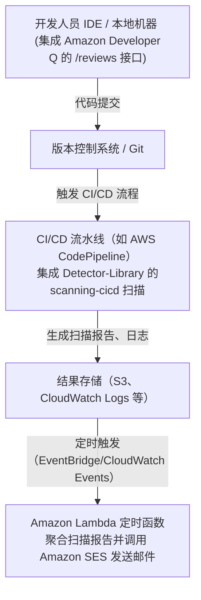
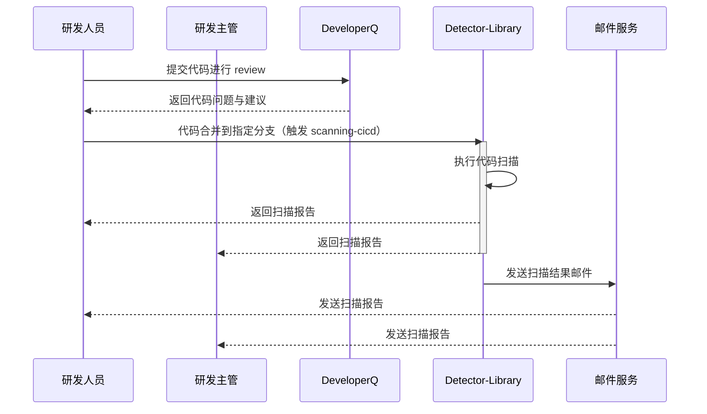

# Code Review 方案

---

## 需求背景

为了提升研发的代码质量，降低代码缺陷率，团队需要一套完整的代码审查方案，包括开发时本地扫描、CI/CD 集成扫描以及定时报告与邮件通知等功能。本文将介绍如何基于 Amazon Developer Q 和 CodeGuru Detector-Library 实现全链路的代码审查方案。

## 方案概述

整个方案主要分为三个模块：

1. **开发时本地扫描模块**  
   开发人员通过集成 Amazon Developer Q 的 **`/reviews`** 扫描工具，在本地或 IDE 插件中执行代码扫描，及时发现并反馈代码问题。

2. **CI/CD 集成扫描模块**  
   在代码提交后，由 CI/CD 流水线触发，利用 Detector-Library 提供的 **scanning-cicd** 功能对代码进行扫描。扫描结果作为构建报告或扫描日志输出，供研发主管审核，并可配置阈值控制是否阻止合并。

3. **报告聚合与邮件通知模块**  
   使用 Amazon Lambda（定时触发，如每天或每周）收集、聚合来自开发扫描与 CI/CD 扫描的报告，格式化后通过邮件（建议借助 Amazon SES 或其他邮件服务）发送到指定邮箱，供项目管理人员及团队成员查阅。

架构示意图（简化描述）如下：

时序图描述如下：
1. **研发人员** 在提交代码前使用 **Developer Q** 进行代码审查；
2. **代码合并** 到指定分支后，触发 **Detector-Library** 的 `scanning-cicd` 进行代码自动扫描；
3. **Detector-Library** 生成扫描报告，并通过 **邮件服务** 发送到 **研发人员** 和 **研发主管** 的邮箱中。

---

## 详细方案说明

### 1 开发时本地扫描 —— 基于 Amazon Developer Q

- **参考文档**：  
  [Amazon Developer Q Code Reviews](https://docs.aws.amazon.com/amazonq/latest/qdeveloper-ug/code-reviews.html)

- **目标**：  
  开发人员在开发过程中，通过调用 Developer Q 的 **`/reviews`** 接口扫描自己编写的代码，及时获得代码问题和改进建议。

- **实现思路**：
  - **扫描工具集成**：  
    开发团队可以开发或采用已有的 CLI 工具/IDE 插件，该工具在本地执行代码静态分析时，将代码文件或代码片段提交给 Amazon Developer Q 的 **`/reviews`** API 接口。
    
  - **API 调用**：  
    配置工具使其能够调用 Developer Q 接口，传递必要的认证信息（如 IAM 角色或 API 密钥）以及代码内容。接口返回问题报告（包含问题描述、建议修改、严重程度等）。
    
  - **反馈机制**：  
    工具将扫描结果以友好的形式展示给开发人员，建议在提交代码前根据报告进行代码优化，降低后续在 CI/CD 阶段发现严重问题的风险。

- **注意事项**：
  - 确保接口调用的权限配置正确，避免因权限不足导致扫描失败；
  - 工具支持本地增量扫描，加快反馈速度；
  - 考虑将扫描结果存入本地日志，便于开发人员后续参考。

---

### 2 CI/CD 集成扫描 —— 基于 Detector-Library 的 scanning-cicd

- **参考文档**：  
  [Amazon Inspector Scanning in CI/CD](https://docs.aws.amazon.com/inspector/latest/user/scanning-cicd.html)  
  （注意：Detector-Library 文档请参考 [CodeGuru Detector-Library](https://docs.aws.amazon.com/codeguru/detector-library/)）

- **目标**：  
  在代码提交后，由 CI/CD 流程自动触发基于 Detector-Library 的扫描，检测代码中潜在的安全、性能及其他问题，由研发主管及时了解整体代码质量状况。

- **实现思路**：
  - **CI/CD 流程嵌入扫描步骤**：  
    在构建流水线（例如使用 AWS CodePipeline、Jenkins、GitLab CI 等）中，增加一个扫描步骤，调用 Detector-Library 提供的 scanning-cicd 工具或命令行接口。
    
  - **扫描流程**：
    - 拉取最新代码；
    - 执行静态代码扫描，Detector-Library 结合预置规则集检测代码问题；
    - 将扫描结果生成报告（如 JSON、HTML 格式），并上传到集中存储（例如 S3 桶）或写入日志系统（CloudWatch Logs）。
    
  - **自动化决策**：
    - 根据扫描报告中问题的数量与严重性，可以设置阈值（例如高风险问题数超过一定数量时），自动中断构建或通知相关负责人。
    - 扫描结果可以在 CI/CD 流程中以报告形式呈现，方便研发主管查阅和决策。

- **注意事项**：
  - 根据团队需求定制 Detector-Library 的扫描规则集；
  - 对扫描工具进行性能调优，避免对 CI/CD 流程造成明显延时；
  - 存储与报告管理时，需考虑数据保留策略与权限控制。

---

### 定时报告与邮件通知 —— 基于 Amazon Lambda

- **目标**：  
  定期汇总开发和 CI/CD 阶段的代码扫描结果，生成整体代码问题报告，并通过邮件发送给指定邮箱（例如研发主管、质量管理人员）。

- **实现思路**：
  - **触发器设置**：  
    使用 Amazon CloudWatch Events（或 EventBridge）配置定时触发器（例如每天凌晨 6 点或每周一次），启动一个 Lambda 函数。
    
  - **Lambda 函数实现**：
    - **数据收集**：  
      在 Lambda 函数中，读取存放在 S3 桶或 CloudWatch Logs 中的扫描报告数据（开发时的 Developer Q 扫描结果以及 CI/CD 阶段的 Detector-Library 扫描报告）。
      
    - **数据聚合与分析**：  
      对扫描报告进行汇总统计，如统计各类型问题的数量、分布及趋势；根据预设规则筛选出高风险问题。
      
    - **报告生成**：  
      格式化汇总报告（可生成 HTML 或文本格式），便于阅读与归档。
      
    - **邮件发送**：  
      利用 Amazon SES（Simple Email Service）或其它邮件服务 API，将生成的报告邮件发送到预设的邮箱地址。邮件主题、正文中可附上详细的扫描结果及建议。
    
  - **错误处理与日志**：
    - Lambda 函数内应做好异常捕获与重试机制；
    - 扫描、聚合及邮件发送过程中的日志写入 CloudWatch Logs，便于后续监控与排查问题。

- **注意事项**：
  - 确保 Lambda 函数拥有读取扫描报告存储位置和调用 SES 的相应权限（配置 IAM 角色）；
  - 邮件发送频率及内容应根据团队需求进行调整，避免频繁发送造成信息冗余。

---

## 安全与权限管理

- **IAM 角色与策略**：  
  为各个 AWS 组件（Lambda、CI/CD 流水线、Developer Q 调用等）配置最小权限原则，确保每个服务只能访问必要的资源。
  
- **数据存储保护**：  
  对存储扫描报告的 S3 桶或日志组，配置适当的访问控制策略，确保只有授权用户可以读取或修改数据。

- **API 访问控制**：  
  对 Developer Q 的 API 调用进行认证和授权管理，建议采用基于 IAM 或 API Gateway 的安全机制。

---

## 部署与监控

- **部署方式**：
  - 使用 AWS CloudFormation 或 Terraform 定义基础设施（Lambda、IAM 角色、CloudWatch Events 规则、S3 桶等）；
  - 将 CI/CD 流水线配置文件（如 CodePipeline 配置、Jenkinsfile 等）纳入版本管理；
  - 开发扫描工具可通过内部包管理系统或容器镜像方式分发给开发人员。

- **监控与报警**：
  - 利用 CloudWatch 监控 Lambda 函数执行情况、错误率和执行时长；
  - 配置 CI/CD 流程的扫描报告报警机制，当扫描结果超出阈值时，及时通知研发主管；
  - 利用 SNS 通知邮件、短信或 Slack 通道，将关键异常事件通知给相关人员。

---

## 总结

本方案实现了从开发阶段到 CI/CD 阶段的全链路代码扫描，利用 Amazon Developer Q 为开发人员提供即时代码质量反馈，借助 Detector-Library 的 scanning-cicd 功能确保代码在提交前达到预期质量，并通过定时 Lambda 函数聚合报告后发送邮件通知，实现自动化代码 Review 流程。各模块之间通过 AWS 服务进行无缝衔接，既保证了安全性和稳定性，又提升了开发和管理效率。

通过该技术方案，团队可在代码开发和交付全流程中及时发现并整改潜在问题，从而提高代码质量、降低风险并加速项目交付。