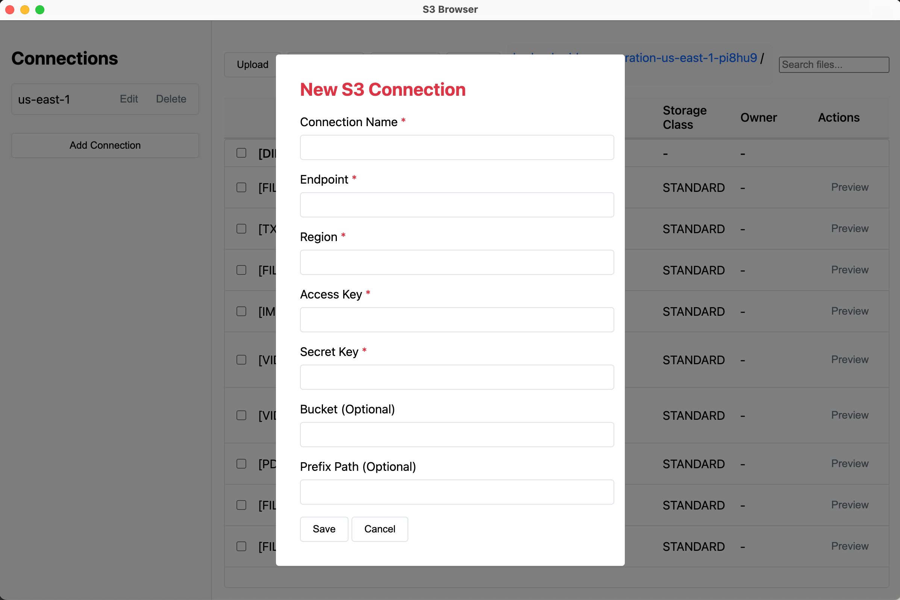
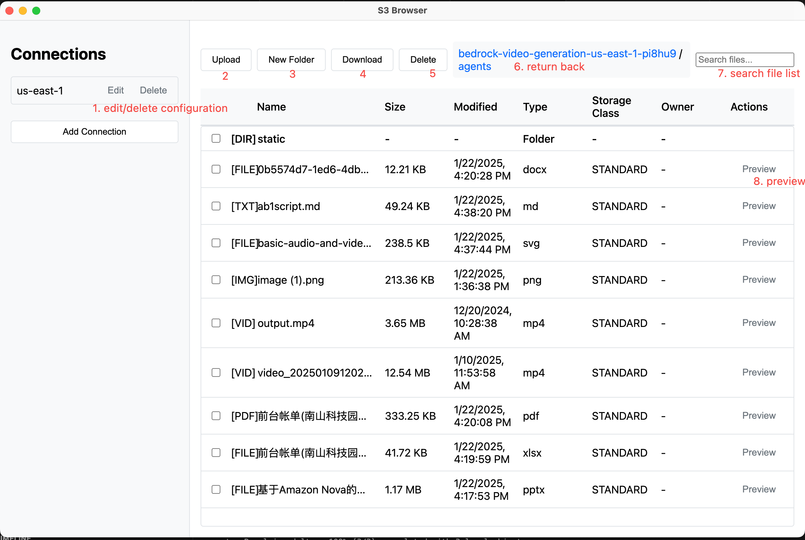

# S3 Browser

A cross-platform desktop application for browsing and managing S3 buckets and objects. Built with Electron and AWS SDK.

## User Guide

### Overview
S3 Browser is a desktop application that allows you to:
- Connect to multiple S3-compatible storage services
- Browse and manage files and folders
- Upload and download files
- Preview various file types directly in the application
- Manage multiple connection profiles

### Getting Started

1. **First Launch**
   - When you first launch the application, you'll see an empty connections list
   - Click "Add Connection" to set up your first S3 connection

2. **Setting Up a Connection**

   - Click "Add Connection" in the sidebar
   - Fill in the connection details:
     * Connection Name: A friendly name for your connection
     * Endpoint: Your S3 service endpoint (e.g., `s3.amazonaws.com`)
     * Region: The S3 region (e.g., `us-east-1`)
     * Access Key: Your S3 access key
     * Secret Key: Your S3 secret key
     * Default Bucket (Optional): Set a default bucket to open
     * Default Prefix (Optional): Set a default folder path


1. **Managing Files**

 
   - **Browsing**:
     * Click on buckets to view their contents
     * Use the breadcrumb navigation to move between folders
     * Use the search box to filter files by name
   
   - **Uploading**:
     * Click "Upload" or drag files into the window
     * Select single or multiple files to upload
     * Files will be uploaded to the current folder
   
   - **Downloading**:
     * Select files by checking their checkboxes
     * Click "Download" to save selected files
     * Choose a save location on your computer
   
   - **Deleting**:
     * Select files or folders to delete
     * Click "Delete" to remove selected items
     * Confirm deletion when prompted

1. **File Preview**
   - Click the "Preview" button next to supported files:
     * Images: jpg, jpeg, png, gif, webp, svg, bmp, ico, tiff, avif
     * Text: txt, md, markdown, json, xml, yaml, yml, ini, csv, log
     * Documents: pdf, doc, docx, xls, xlsx, ppt, pptx
     * Web: html
     * Video: mp4

### Configuration File
The application stores its settings in a configuration file:
- Windows: `%APPDATA%/s3browser/config.json`
- macOS: `~/Library/Application Support/s3browser/config.json`
- Linux: `~/.config/s3browser/config.json`

### Tips and Tricks
1. **Efficient Navigation**:
   - Use breadcrumb navigation for quick folder jumping
   - Use the search box to quickly find files
   - Double-click folders to navigate into them

2. **File Operations**:
   - Use checkboxes to select multiple files
   - Drag and drop files for upload
   - Use preview for quick file inspection

3. **Connection Management**:
   - Set default buckets for frequently accessed locations
   - Use meaningful connection names for easy identification
   - Store different credentials for different S3 services

## Features

### Connection Management
- Multiple S3 connection profiles support
  - Save and manage multiple S3 endpoint configurations
  - Support for AWS S3 and S3-compatible services
  - Secure credential storage using electron-store
  - Edit existing connections
  - Delete unused connections
  - Optional default bucket and prefix path settings

### File Operations
- Browse buckets and folders
  - List all available buckets
  - Navigate through folder hierarchies
  - Breadcrumb navigation for easy path tracking
  - File/folder size display
  - Last modified timestamps
  - Storage class information
  - Owner information

### Configuration
- Configuration file location:
  - Windows: `%APPDATA%/s3browser/config.json`
  - macOS: `~/Library/Application Support/s3browser/config.json`
  - Linux: `~/.config/s3browser/config.json`
- Upload Operations
  - Upload single or multiple files
  - Create new folders
  - Progress tracking for uploads
- Download Operations
  - Download single files
  - Batch download multiple files
  - Save location selection
- Delete Operations
  - Delete single files
  - Batch delete multiple files
  - Delete folders recursively
- File Preview
  - Image preview with zoom (supports jpg, jpeg, png, gif, webp, svg, bmp, ico, tiff, avif)
  - Text file preview with syntax highlighting (supports txt, md, markdown, json, xml, yaml, yml, ini, csv, log)
  - PDF preview using Google Docs Viewer
  - Microsoft Office files preview (doc, docx, xls, xlsx, ppt, pptx)
  - HTML file preview
  - Video preview (mp4)
  - File metadata display
- Search and Filter
  - Real-time file filtering
  - Search by filename
  - Filter by file type

### User Interface
- Modern and Intuitive Design
  - Clean, responsive layout
  - Drag and drop support
  - Context menus for operations
  - File type icons
  - Size formatting
  - Date formatting
- Operation Feedback
  - Loading spinners for operations
  - Progress indicators
  - Error messages with details
  - Success confirmations
- Debug Features
  - Developer Tools integration
  - Console logging for operations
  - Network request tracking
  - Error stack traces

## Architecture

### Main Components

1. **main.js (Main Process)**
   - Electron main process configuration
   - Window management and lifecycle
   - IPC (Inter-Process Communication) handlers:
     - Connection management (save, load, delete)
     - S3 operations (list, upload, download, delete)
     - File dialogs and system integration
   - S3 client configuration and operations:
     - Dynamic client creation based on connection settings
     - Bucket operations (ListBucketsCommand)
     - Object operations (ListObjectsV2Command, PutObjectCommand, etc.)
   - Error handling and logging

2. **renderer.js (Renderer Process)**
   - UI state management:
     - Current connection tracking
     - Current bucket and prefix path
     - Selected files management
   - Event handlers:
     - Connection selection and management
     - File/folder navigation
     - Upload/download operations
     - Delete operations
     - File preview
   - Loading state management:
     - Global loading overlay
     - Button-specific loading states
     - Operation progress tracking
   - Error handling and display:
     - Operation-specific error messages
     - User-friendly error notifications
     - Debug logging

3. **index.html (UI Layer)**
   - Application structure:
     - Sidebar for connections
     - Main content area for file browser
     - Toolbars and navigation
   - Modal components:
     - Connection management
     - Folder creation
     - File preview
   - Styling:
     - Responsive grid layouts
     - Loading animations
     - File type icons
     - Operation feedback

### Business Logic Implementation

1. **Connection Management**
   ```javascript
   // Connection storage using electron-store
   const store = new Store();
   
   // Save connection
   ipcMain.handle('save-connection', async (event, connection) => {
     const connections = store.get('connections', []);
     connections.push(connection);
     store.set('connections', connections);
   });
   ```

2. **S3 Operations**
   ```javascript
   // List objects in bucket/folder
   ipcMain.handle('list-objects', async (event, connectionId, bucket, prefix) => {
     const client = createS3Client(connection);
     const command = new ListObjectsV2Command({
       Bucket: bucket,
       Prefix: prefix,
       Delimiter: '/'
     });
     const response = await client.send(command);
     // Process and return folders and files
   });
   ```

3. **File Navigation**
   ```javascript
   // Navigate to folder
   async function navigateTo(prefix) {
     try {
       currentPrefix = prefix.endsWith('/') ? prefix : prefix + '/';
       updateBreadcrumb();
       await loadFiles();
     } catch (error) {
       console.error('Navigation error:', error);
     }
   }
   ```

4. **Error Handling**
   ```javascript
   // Global error handler
   window.webContents.on('console-message', (event, level, message) => {
     const levels = ['debug', 'info', 'warning', 'error'];
     console.log(`[${levels[level]}] ${message}`);
   });
   ```

### Code Structure

```
s3browser/
├── main.js           # Main process & S3 operations
├── renderer.js       # UI logic & event handling
├── index.html       # UI layout & styling
└── package.json     # Dependencies & build config
```

## Development

### Prerequisites

- Node.js 14+
- npm or yarn
- Electron
- AWS SDK v3

### Setup Development Environment

1. Clone the repository:
```bash
git clone <repository-url>
cd s3browser
```

2. Install dependencies:
```bash
npm install
```

3. Start development server:
```bash
npm start
```

### Debug Mode

The application includes built-in debugging capabilities:

- DevTools opens automatically in development
- Console logging for operations
- Error tracking and display
- State logging for navigation

To view logs:
1. Open DevTools (automatically opened in development)
2. Check the Console tab for operation logs
3. Check the Network tab for S3 requests

## Building

### Build Prerequisites

- Node.js 14+ (recommended: Node.js 16 LTS)
- npm or yarn
- electron-builder globally installed (`npm install -g electron-builder`)
- Platform-specific requirements:
  - Windows:
    - Windows 10+ recommended
    - Visual Studio Build Tools (optional)
  - macOS:
    - macOS 10.15+ recommended
    - Xcode Command Line Tools (`xcode-select --install`)
    - Apple Developer account (for signing)
  - Linux:
    - Ubuntu 18.04+ or similar
    - icnsutils (`apt-get install icnsutils`)
    - graphicsmagick (`apt-get install graphicsmagick`)
    - rpm (`apt-get install rpm`) for RPM builds

### Build Commands

Development build and run:
```bash
# Install dependencies
npm install

# Start in development mode
npm start

# Start with debug logging
DEBUG=1 npm start
```

#### Production Builds

Windows:
```bash
# Build installer
npm run build -- --win
# Output: dist/s3browser-setup.exe

# Build portable version
npm run build -- --win portable
# Output: dist/s3browser.exe
```

macOS:
```bash
# Build DMG installer
npm run build -- --mac
# Output: dist/s3browser.dmg

# Build for Mac App Store
npm run build -- --mac mas
# Output: dist/s3browser.pkg
```

Linux:
```bash
# Build AppImage
npm run build -- --linux AppImage
# Output: dist/s3browser.AppImage

# Build DEB package
npm run build -- --linux deb
# Output: dist/s3browser.deb

# Build RPM package
npm run build -- --linux rpm
# Output: dist/s3browser.rpm
```

Build for all platforms (requires appropriate development environment):
```bash
# Build for all platforms
npm run build -- -mwl

# Build with specific configurations
npm run build -- -mwl --x64 --ia32
```

### Build Configuration

Build settings are configured in package.json:

```json
{
  "build": {
    "appId": "com.s3browser.app",
    "mac": {
      "category": "public.app-category.utilities"
    },
    "win": {
      "target": "nsis"
    },
    "linux": {
      "target": "AppImage"
    }
  }
}
```

## Error Handling

The application implements comprehensive error handling:

1. Connection Errors
   - Invalid credentials
   - Network issues
   - Endpoint connectivity

2. Operation Errors
   - File access permissions
   - Upload/download failures
   - Bucket access restrictions

3. UI Feedback
   - Loading indicators
   - Error messages
   - Operation status updates

## Dependencies

- electron: Desktop application framework
- @aws-sdk/client-s3: AWS S3 operations
- electron-store: Secure connection storage
- electron-builder: Application packaging

## License

MIT License
