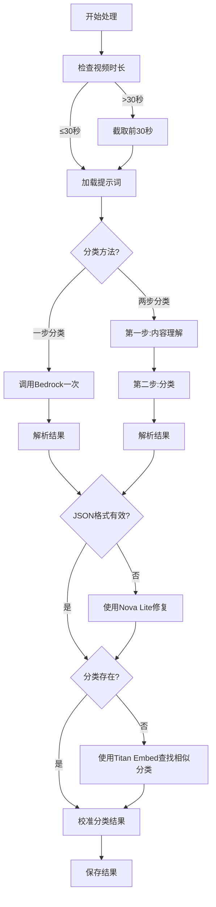
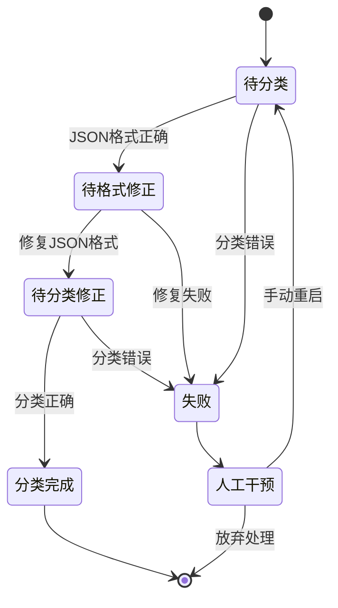
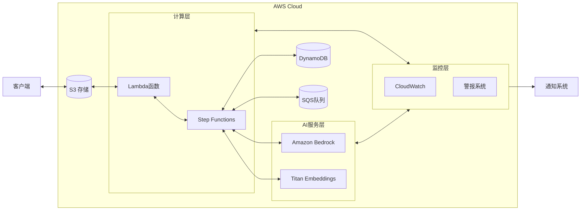

# 大规模视频内容分类系统

## 1. 需求背景

### 大规模视频内容分类的市场需求
- 短视频平台内容爆发式增长，需要高效分类管理
- 内容推荐、精准广告投放、内容合规监控等场景需求日益增长
- 手动分类无法满足大规模处理需求

### 视频内容理解与自动分类的挑战
- 视频内容复杂多样性：视觉、音频、文本等多模态信息融合
- 语义理解难度：抽象概念、文化背景差异、上下文依赖性
- 分类体系复杂：多层级分类体系的精准分类

### 传统分类方法的局限性
- 基于标签的分类：依赖人工标注，标签覆盖不全
- 单一模态分析：只分析视频的部分特征，忽略整体语义
- 可扩展性差：对新类别适应性较低

### 多模态大模型带来的机会
- 跨模态理解：同时理解视频中的视觉、音频和文本信息
- 语义级别理解：把握内容主题和意图，而非仅识别物体
- 持续进化能力：适应不断变化的内容类型和分类需求

## 2. 需求分析

### 客户短视频为主
- 系统主要处理短视频内容，需要高效、准确的分类方案
- 平均视频长度小于1分钟，允许截取前30秒进行分析

### 成本因素考量
- 视频处理的API调用成本需要严格控制
- 每个视频的处理时间和资源消耗需要最小化
- 平衡准确率和处理成本的最优解决方案

### 处理规模
- 存量视频约100万条
- 每周新增视频约10万条
- 需要高效的批量处理能力和可扩展的系统架构

### 技术选型考量
- 利用Amazon Bedrock的Nova多模态模型，支持原生视频输入
- 无需额外的视频预处理步骤，可以直接处理视频内容
- 视频长度超过30秒时截取前30秒进行分析，平衡效率和准确性

## 3. 方案选型

### 模型对比

| 特性 | Nova Lite | Nova Pro |
| --- | --- | --- |
| 一次分类准确率 | ~50% | ~90% |
| 处理速度 | 更快 | 较慢 |
| Token成本 | 更低 | 较高 |
| 多类别处理能力 | 一般 | 优秀 |

### 分类方法对比

| 特性 | 一步分类法 | 两步分类法 |
| --- | --- | --- |
| 处理流程 | 单次模型调用 | 两次模型调用 |
| 准确性 | 较低 | 较高 |
| 处理时间 | 更短 | 更长 |
| Token消耗 | 更少 | 更多 |

### 最终选择
- **使用Nova Pro模型进行一次分类**
- 每个视频截取前30秒进行分析
- 整体成本可控，准确率高达90%以上

## 4. 系统架构和实现

### 总体架构
- 分布式视频处理系统
- S3存储视频内容
- AWS Lambda触发处理
- Step Functions编排工作流
- DynamoDB存储处理结果
- SQS队列管理失败重试
- CloudWatch监控系统状态

### 核心模块
- **视频处理模块**: 处理视频提取和预处理
- **分类模块**: 调用Bedrock API进行视频分类
- **结果校准模块**: 使用Titan Embeddings提高分类准确性
- **评估模块**: 评估分类结果准确性

### 处理流程

### 系统状态管理

### AWS云架构

## 5. 踩坑总结与心得

### 配额问题
- **问题**: 新账号默认quota只有1/10，无法满足大规模处理需求
- **解决**: 提前申请提高配额，建立配额监控系统

### 资源限制和BUG
- **问题**: Bedrock接口频繁返回503、424异常，影响客户体验
- **问题**: 请求失败可能导致客户重复分类，造成额外成本
- **解决**: 实现错误重试机制，限制重试次数，记录失败状态

### 使用状态机完成任务
- **实现**: 使用Step Functions创建多任务协作工作流
- 每个任务只处理其中一个状态
- 每次模型调用后立即保存结果，避免重复调用
- 实现断点续传，提高系统稳定性

### Bedrock调用心得
- **TopP参数调整**: 设置为0.9平衡多样性和一致性
- **Temperature设置**: 低温度(0.0)确保输出一致性
- **处理超时**: 设置适当的超时时间，避免长时间等待

### Prompt工程心得
- **问题**: 大的input内容会降低模型遵循指令的准确性
- **问题**: JSON输出格式经常缺失样本字段，需要修复
- **解决**: 使用结构化的XML输出格式提高稳定性
- **优化**: 使用两步分类法时，第一步仅提取内容理解，第二步专注分类 